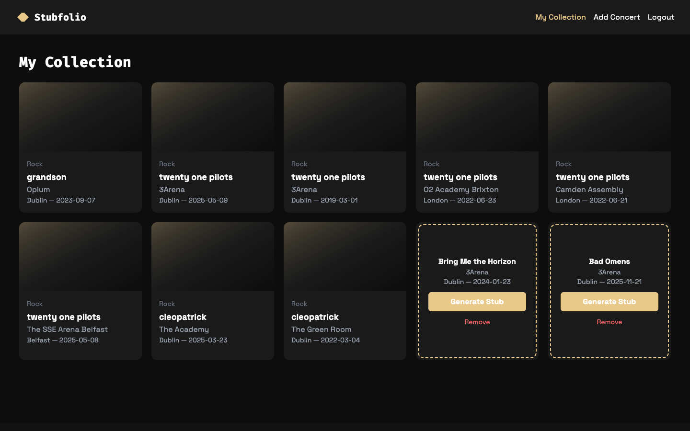
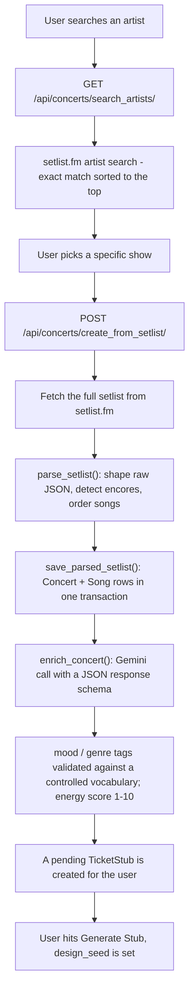

# Stubfolio

**A digital shelf for the concerts you've been to.** Search for an artist, pick the exact
show you attended, and Stubfolio pulls the real setlist from [setlist.fm](https://www.setlist.fm/),
uses an LLM to tag the night's _mood_, _genre_ and _energy_ from what was played, and turns it
into a collectible ticket stub in your personal collection.

  <a href="https://github.com/jordan-hennessy/stubfolio/actions/workflows/backend-tests.yml">
    
  </a>
  
  
  
  
  <a href="./LICENSE"></a>

### Live

|                        |                                                  |
| ---------------------- | ------------------------------------------------ |
| **App**                | https://stubfolio.vercel.app                     |
| **API docs (Swagger)** | https://stubfolio-backend.onrender.com/api/docs/ |
| **API root**           | https://stubfolio-backend.onrender.com/api/      |

> The API is hosted on a free Render instance, so the first request after a period of
> inactivity takes ~30s while the service wakes up.



---

## How it works

The interesting part of Stubfolio is the pipeline that turns a setlist.fm listing into an
enriched, validated `Concert` record.



Design decisions worth calling out:

- **The LLM output is constrained, then validated twice.** `enrich_concert()` sends Gemini a
  `response_schema` so it can only return the shape we expect, and the API response serializer
  re-validates every tag against `MOOD_CHOICES` / `GENRE_CHOICES` with a DRF `ChoiceField`.
  A hallucinated tag is rejected rather than stored.
- **Persistence is atomic.** `save_parsed_setlist()` wraps the `Concert` and all its `Song`
  rows in `transaction.atomic()`, and uses `get_or_create` on the setlist.fm ID so importing
  the same show twice is a no-op instead of a duplicate.
- **External failures degrade gracefully.** setlist.fm rate-limits aggressively; the service
  layer treats `429`/`404` as "no result" (`None`) instead of throwing, and the UI retries.
- **Data is isolated per user.** Every authenticated endpoint filters its queryset by
  `request.user` (`Concert.objects.filter(ticket_stubs__user=...)`), so one account can never
  read or mutate another's collection. This is covered by tests.
- **The schema is generated, not hand-written.** `drf-spectacular` produces the OpenAPI 3
  document and Swagger UI directly from the serializers and viewsets.

---

## Features

- Artist search with exact-match relevance sorting
- Browse an artist's shows, filtered by year and country
- One-click import of a real setlist into your collection
- Automatic mood / genre / energy enrichment from the songs played
- Per-user collections with token authentication
- Pending vs. generated ticket-stub states
- Remove-with-confirmation flow
- Auto-generated, browsable API documentation

---

## Tech stack

| Layer         | Choice                                              | Notes                                         |
| ------------- | --------------------------------------------------- | --------------------------------------------- |
| Backend       | **Django 5.1 + Django REST Framework**              | Viewsets, routers, token auth                 |
| Database      | **PostgreSQL** (Neon in prod)                       | Falls back to SQLite locally with zero config |
| API schema    | **drf-spectacular**                                 | OpenAPI 3 + Swagger UI + ReDoc                |
| External data | **setlist.fm REST API**                             | Artist / setlist lookup                       |
| Enrichment    | **Google Gemini** (`google-genai`)                  | Structured JSON output                        |
| Tests         | **pytest + pytest-django + pytest-mock**            | 27 tests, all outbound calls mocked           |
| Tooling       | **uv**                                              | Dependency resolution and virtualenv          |
| Server        | **gunicorn**                                        | Containerised via `backend/Dockerfile`        |
| Frontend      | **React 19 + TypeScript + Vite**                    |                                               |
| Routing       | **react-router 7**                                  |                                               |
| Styling       | **Tailwind CSS 4**                                  | Dark theme, custom design tokens              |
| Motion        | **framer-motion**                                   |                                               |
| Hosting       | **Vercel** (web) + **Render** (API) + **Neon** (DB) |                                               |

---

## Repository layout

```
stubfolio/
├── backend/
│   ├── stubfolio/            # Django project (settings, urls, wsgi/asgi)
│   ├── apps/
│   │   ├── core/             # Health check endpoint
│   │   └── concerts/         # Domain app
│   │       ├── models.py     # Concert, Song, TicketStub
│   │       ├── services.py   # setlist.fm client + parsing + Gemini enrichment
│   │       ├── views.py      # ConcertViewSet, TicketStubViewSet
│   │       ├── views_auth.py # Login / signup
│   │       ├── serializers.py
│   │       └── constants.py  # Controlled vocabulary for mood/genre tags
│   ├── tests/                # pytest suite
│   ├── Dockerfile
│   └── pyproject.toml
└── frontend/
    └── src/
        ├── pages/            # Login, Signup, MyCollection, AddConcert, ConcertDetail
        ├── components/       # Navbar
        └── App.tsx           # Routes
```

---

## API overview

Full interactive docs: **https://stubfolio-backend.onrender.com/api/docs/**

| Method                       | Endpoint                             | Auth  | Purpose                                            |
| ---------------------------- | ------------------------------------ | ----- | -------------------------------------------------- |
| `POST`                       | `/api/signup/`                       | –     | Create an account, returns a token                 |
| `POST`                       | `/api/login/`                        | –     | Exchange credentials for a token                   |
| `GET`                        | `/api/health/`                       | –     | Liveness probe                                     |
| `GET`                        | `/api/concerts/search_artists/`      | token | Search setlist.fm for an artist                    |
| `GET`                        | `/api/concerts/artist_setlists/`     | token | List a given artist's shows (year/country filters) |
| `GET`                        | `/api/concerts/search_setlists/`     | token | Free-text setlist search                           |
| `POST`                       | `/api/concerts/create_from_setlist/` | token | Import a show → enriched `Concert` + pending stub  |
| `GET`                        | `/api/concerts/`                     | token | The caller's collection                            |
| `GET`                        | `/api/concerts/{id}/`                | token | A single concert in the caller's collection        |
| `GET`/`POST`                 | `/api/ticket-stubs/`                 | token | List / create ticket stubs                         |
| `GET`/`PUT`/`PATCH`/`DELETE` | `/api/ticket-stubs/{id}/`            | token | Manage a stub                                      |
| `POST`                       | `/api/ticket-stubs/{id}/generate/`   | token | Set the stub's `design_seed`                       |

Authenticate by sending `Authorization: Token <token>` on every protected request.

---

## Local development

### Prerequisites

- **Python 3.12+** (3.13 recommended) and [`uv`](https://docs.astral.sh/uv/)
- **Node 20.19+ or 22.12+** and npm
- A free **setlist.fm API key** - https://api.setlist.fm/docs/1.0/index.html
- A **Gemini API key** - https://aistudio.google.com/apikey

### Backend

```bash
cd backend
cp .env.example .env          # then fill in SECRET_KEY + the two API keys
uv sync                       # create the venv and install deps
uv run python manage.py migrate
uv run python manage.py runserver
```

The API is now on `http://localhost:8000` (Swagger at `/api/docs/`). With no `DATABASE_URL`
set it uses a local `db.sqlite3` file - no database server required. Create an admin user
with `uv run python manage.py createsuperuser` if you want the Django admin.

### Frontend

```bash
cd frontend
cp .env.example .env           # VITE_API_URL defaults to http://localhost:8000
npm install
npm run dev
```

The app is now on `http://localhost:5173`. Open **`/signup`** to get started.

### Environment variables

**`backend/.env`**

| Variable               | Required | Default                 | Purpose                         |
| ---------------------- | -------- | ----------------------- | ------------------------------- |
| `SECRET_KEY`           | yes      | –                       | Django secret key               |
| `DEBUG`                | no       | `False`                 | Debug mode                      |
| `ALLOWED_HOSTS`        | no       | `localhost,127.0.0.1`   | Comma-separated hosts           |
| `SETLISTFM_API_KEY`    | yes      | –                       | setlist.fm auth                 |
| `GEMINI_API_KEY`       | yes      | –                       | Gemini auth                     |
| `DATABASE_URL`         | no       | SQLite file             | Postgres connection string      |
| `CORS_ALLOWED_ORIGINS` | no       | `http://localhost:5173` | Comma-separated allowed origins |

**`frontend/.env`**

| Variable       | Required | Default                 | Purpose          |
| -------------- | -------- | ----------------------- | ---------------- |
| `VITE_API_URL` | no       | `http://localhost:8000` | Backend base URL |

---

## Testing

```bash
cd backend
uv run pytest          # 27 tests
uv run pytest -v       # verbose
```

Every outbound HTTP call (setlist.fm, Gemini) is mocked, so the suite is fast, deterministic
and needs no API keys or network. It runs on SQLite. Coverage includes:

- **Setlist parsing** - encore detection, date parsing, continuous song numbering across sets
- **Artist matching** - exact-match filtering, relevance sorting, rate-limit (`429`) handling
- **Import flow** - `create_from_setlist` end to end with externals mocked, including the
  pending-stub side effect and de-duplication by setlist.fm ID
- **Auth & isolation** - protected endpoints reject anonymous callers; a user only ever sees
  their own stubs; `generate` refuses another user's stub
- **Signup** - token issuance, duplicate-username and missing-password rejection

CI runs the same suite on every push and pull request that touches `backend/`
(`.github/workflows/backend-tests.yml`).

---

## Deployment

| Piece    | Host       | Config                                                                |
| -------- | ---------- | --------------------------------------------------------------------- |
| Web app  | **Vercel** | `frontend/vercel.json` (SPA rewrite); `VITE_API_URL` → the Render URL |
| API      | **Render** | Docker build from `backend/Dockerfile`, `gunicorn stubfolio.wsgi`     |
| Database | **Neon**   | Serverless Postgres; connection string via `DATABASE_URL`             |

Backend environment variables (`SECRET_KEY`, `SETLISTFM_API_KEY`, `GEMINI_API_KEY`,
`DATABASE_URL`, `ALLOWED_HOSTS`, `CORS_ALLOWED_ORIGINS`) are set in the Render dashboard.

---

## Roadmap / known limitations

This is an actively-developed project. Currently on the list:

- **No marketing landing page yet** - `/` redirects straight to the login screen.
- **Concert detail page** (`/concerts/:id`) is a placeholder.
- **Ticket-stub artwork** - `generate` currently just sets a seed string; the generative
  stub design is the next feature.
- **Production hardening** - WhiteNoise/`collectstatic` for admin assets and `SECURE_*`
  headers are not wired up yet.
- **API schema metadata** - `drf-spectacular` title/description/version still default.
- **No frontend test suite** yet.

---

## License

MIT - see [`LICENSE`](./LICENSE).
